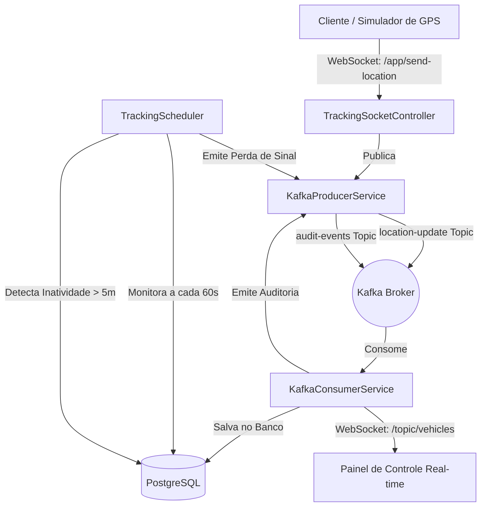

# Sistema de Rastreamento de Veículos de Emergência 🚑🚨

Este é um projeto de backend completo e robusto desenvolvido em **Java 21** e **Spring Boot** para o rastreamento em tempo real de veículos de emergência. A arquitetura foi desenhada seguindo as melhores práticas de mercado, integrando mensageria assíncrona com **Apache Kafka**, comunicação bidirecional de baixa latência em tempo real com **WebSockets**, banco de dados relacional **PostgreSQL** para persistência e **Flyway** para migrações do esquema de banco.

---

## 🛠️ Tecnologias Utilizadas

- **Linguagem:** Java 21
- **Framework:** Spring Boot
- **Banco de Dados:** PostgreSQL (com Flyway Migration)
- **Mensageria:** Apache Kafka (com Jackson/JSON Serializers)
- **Real-Time:** WebSockets (com STOMP e SockJS)
- **Segurança:** Spring Security (configurado com acesso público para simplificação de testes/portfólio)
- **Containerização:** Docker & Docker Compose
- **Utilitários:** Lombok, Jakarta Validation

---

## 📐 Arquitetura e Fluxo do Sistema



1. **Simulação / Entrada de Dados:** Um cliente ou simulador se conecta via WebSocket no endpoint `/ws-tracking` e envia coordenadas via `/app/send-location`.
2. **Ingestão Assíncrona:** O `TrackingSocketController` encaminha o evento para o `KafkaProducerService`, que o publica no tópico `location-update` de forma assíncrona, garantindo alto throughput e resiliência.
3. **Consumo e Processamento:** O `KafkaConsumerService` escuta o tópico, realiza a persistência da última localização do veículo e insere um registro histórico na tabela de telemetria. Além disso, emite o estado atualizado em tempo real para os clientes conectados no canal WebSocket `/topic/vehicles`.
4. **Agendamento e Monitoramento:** O `TrackingScheduler` roda a cada 60 segundos buscando veículos ativos que não enviam atualizações há mais de 5 minutos, marcando-os como inativos e publicando um evento de auditoria `TRACKING_SIGNAL_LOST` no Kafka.
5. **API de Consulta:** Um conjunto de endpoints REST expõe o histórico de posições, localização atual e estatísticas calculadas (velocidade máxima e média convertidas de m/s para km/h).

---

## 🚀 Como Executar o Projeto

### Pré-requisitos
- **Java 21** instalado.
- **Docker e Docker Compose** instalados e em execução.

### 1. Subir a Infraestrutura (PostgreSQL, Kafka e Redis)
No diretório raiz do projeto, execute o comando para subir os containers das dependências:
```bash
docker-compose up -d
```

### 2. Compilar e Executar a Aplicação Spring Boot
Você pode rodar diretamente na sua IDE favorita ou via terminal utilizando o Maven local/embutido:
```bash
# Se tiver o Maven instalado no PATH:
mvn spring-boot:run

# Caso use a distribuição local configurada no projeto:
./.maven-bin/apache-maven-3.9.8/bin/mvn spring-boot:run
```

O Flyway aplicará automaticamente as migrações no PostgreSQL (`V1__create_tables.sql` e `V2__create_vehicles_and_telemetry.sql`) na inicialização da aplicação.

---

## 📡 Endpoints REST e WebSockets

### 🚗 Gerenciamento de Veículos (`/vehicles`)
- **Criar Veículo (`POST /vehicles`):**
  ```json
  {
    "name": "Ambulância SAMU 02",
    "plate": "ABC-1234",
    "type": "AMBULANCE",
    "status": "AVAILABLE",
    "latitude": -23.55052,
    "longitude": -46.633308,
    "speed": 0.0,
    "trackingEnabled": true,
    "lastSeen": "2026-07-03T12:00:00Z"
  }
  ```
- **Atualizar Veículo (`PUT /vehicles/{id}`):** Edita dados do veículo.
- **Remover Veículo (`DELETE /vehicles/{id}`):** Deleta o veículo e todo seu histórico de telemetria (Cascading).
- **Listar Todos (`GET /vehicles`):** Retorna todos os veículos cadastrados.
- **Buscar por ID (`GET /vehicles/{id}`):** Retorna os detalhes de um veículo específico.

### 📍 Rastreamento e Telemetria (`/tracking`)
- **Histórico Completo (`GET /tracking/{vehicleId}/history`):** Histórico de todas as posições salvas por ordem cronológica.
- **Histórico por Janela de Tempo (`GET /tracking/{vehicleId}/history/hours?hours=X`):** Busca as localizações registradas nas últimas `X` horas.
- **Localização Atual (`GET /tracking/{vehicleId}/current`):** Retorna a última posição conhecida do veículo direto da tabela ativa.
- **Estatísticas (`GET /tracking/{vehicleId}/stats`):** Retorna estatísticas de telemetria incluindo o sinal inicial, sinal mais recente, quantidade de sinais capturados, velocidade média e máxima convertidas para **km/h**.

### 🔌 WebSocket (`ws-tracking`)
- **Endpoint de Conexão:** `ws://localhost:8080/ws-tracking`
- **Tópico de Envio (Client -> Server):** `/app/send-location`
  - *Payload esperado:*
    ```json
    {
      "vehicleId": 1,
      "latitude": -23.55052,
      "longitude": -46.633308,
      "speed": 12.5,
      "heading": 180.0,
      "accuracy": 5.0
    }
    ```
- **Tópico de Inscrição (Server -> Client):** `/topic/vehicles` (Atualizações em tempo real enviadas pelo Kafka Consumer).

---

## 🧼 Organização e Boas Práticas Demonstradas

- **DTOs com Records:** Redução de boilerplate para transporte de dados imutáveis e limpos.
- **JPA & Migrations com Flyway:** Organização evolutiva do banco de dados relacional.
- **Spring Boot Scheduling:** Execução de rotinas em background para checagem de regras de negócio de tempo (heartbeat de veículos).
- **Kafka & Event-Driven Design:** Arquitetura orientada a eventos para desacoplamento e escalabilidade do fluxo de telemetria.
- **Tratamento de Exceções Global:** Uso de exceções personalizadas (`ResourceNotFoundException`) com códigos HTTP apropriados (`404 Not Found`).
- **Validação de Payload:** Uso de anotações Jakarta Validation (`@NotNull`, `@Valid`) garantindo integridade dos dados de entrada.
- **Organização de Enums:** Mapeamento de tipos e estados de veículos como Enums consistentes salvos como String no banco para leitura direta e relatórios limpos.
