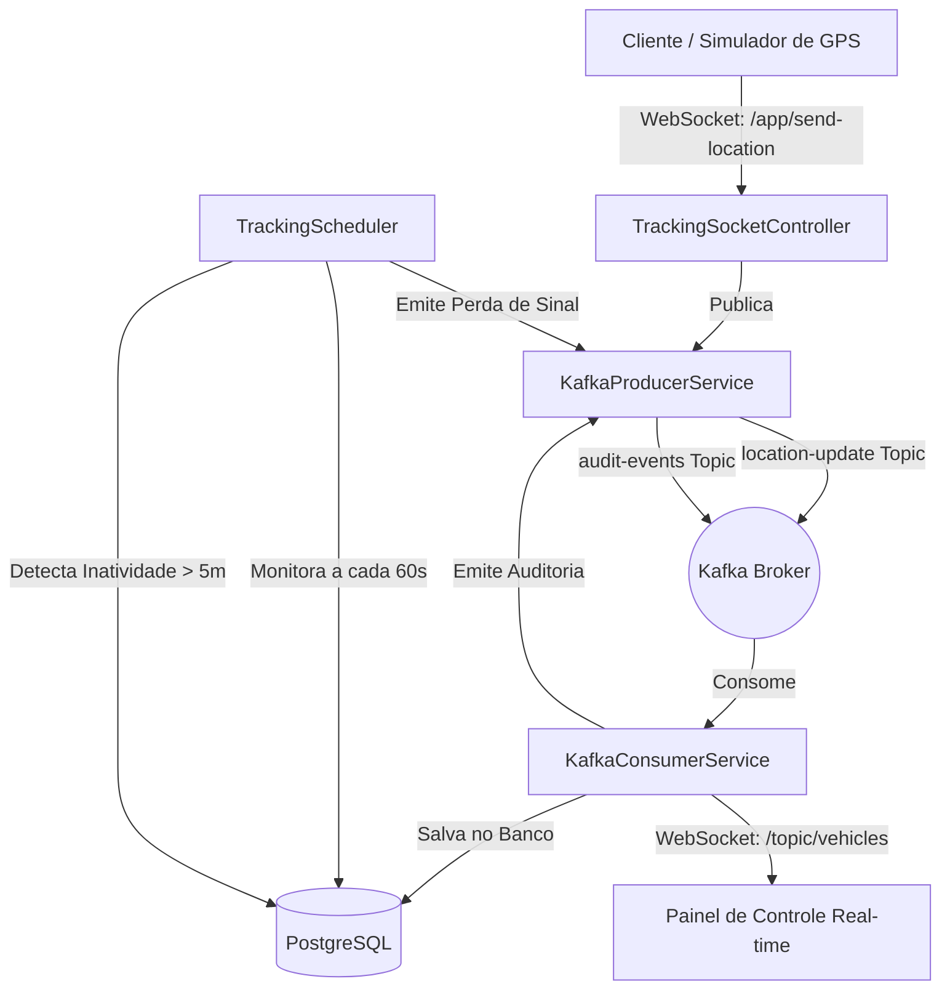
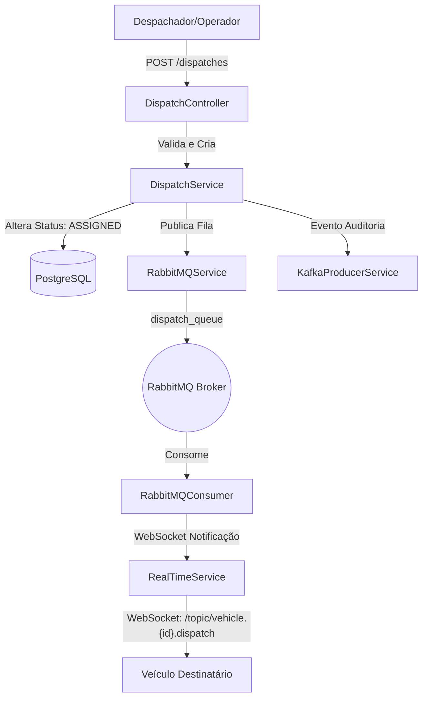

# Sistema de Rastreamento e Despacho de Veículos de Emergência 🚑🚨

Este é um projeto de backend completo e robusto desenvolvido em **Java 21** e **Spring Boot** para o rastreamento em tempo real e despacho inteligente de veículos de emergência. A arquitetura foi desenhada seguindo as melhores práticas de mercado, integrando mensageria assíncrona com **Apache Kafka**, processamento de filas com **RabbitMQ**, comunicação bidirecional de baixa latência em tempo real com **WebSockets**, banco de dados relacional **PostgreSQL** para persistência, **Flyway** para migrações do esquema de banco de dados e **Spring Security com JWT** para autenticação e autorização robustas.

---

## 🛠️ Tecnologias Utilizadas

- **Linguagem:** Java 21
- **Framework:** Spring Boot (v4.1.0)
- **Banco de Dados:** PostgreSQL (com Flyway Migration)
- **Mensageria & Filas:** 
  - **Apache Kafka** (Ingestão de alta vazão de coordenadas e eventos de auditoria)
  - **RabbitMQ** (Orquestração assíncrona do fluxo de despacho)
- **Real-Time:** WebSockets (com STOMP e SockJS)
- **Segurança:** Spring Security com autenticação stateless por tokens **JWT** (JSON Web Tokens)
- **Containerização:** Docker & Docker Compose
- **Utilitários:** Lombok, Jakarta Validation

---

## 📐 Arquitetura e Fluxo do Sistema

### 1. Fluxo de Rastreamento (Telemetria em Tempo Real)


- **Entrada de Dados:** Um simulador ou dispositivo móvel se conecta via WebSocket `/ws-tracking` e envia coordenadas via `/app/send-location`.
- **Ingestão Assíncrona:** O `TrackingSocketController` publica as coordenadas no tópico `location-update` do Kafka, assegurando alta resiliência e processamento não-bloqueante.
- **Consumo e WebSocket Broadcast:** O `KafkaConsumerService` consome o evento, registra no banco de dados (tabela de veículos e tabela histórica de telemetria) e encaminha a localização atualizada via WebSocket para `/topic/vehicles`.
- **Inatividade (Heartbeat):** O `TrackingScheduler` monitora veículos que não enviam atualizações há mais de 5 minutos, alterando seu estado para offline e disparando um evento de auditoria `TRACKING_SIGNAL_LOST` no Kafka.

### 2. Fluxo de Despacho e Ciclo de Vida da Designação


- **Criação de Incidente:** O operador cria uma ocorrência através de `POST /incidents`.
- **Despacho:** O operador faz um `POST /dispatches` vinculando um veículo disponível a um incidente pendente.
  - O veículo é marcado como `DISPACHED` e o incidente como `IN_PROGRESS`.
  - Uma designação (`Assignment`) é salva no banco de dados com o status `ASSIGNED`.
  - Uma mensagem é enviada ao RabbitMQ (`dispatch_queue`).
  - Um log de auditoria `DISPATCH_ASSIGNED` é emitido via Kafka.
- **Notificação em Tempo Real:** O `RabbitMQConsumer` processa a mensagem da fila e emite um alerta WebSocket diretamente ao canal do veículo (`/topic/vehicle.{id}.dispatch`).
- **Atualização de Status (Transição de Estados):** O veículo envia atualizações através de `PUT /dispatches/{id}/status`.
  - **ACCEPTED:** O veículo aceita e registra a hora de aceite (`acceptedAt`).
  - **EN_ROUTE:** O veículo inicia o deslocamento. Status do veículo muda para `EN_ROUTE`.
  - **ARRIVED:** O veículo chega ao local. Status do veículo muda para `AT_INCIDENT` e registra `arrivedAt`.
  - **COMPLETED:** Ocorrência resolvida. Status do veículo muda para `AVAILABLE`, o do incidente muda para `RESOLVED`, e a designação registra `completedAt` com status `COMPLETED`.
  - **CANCELLED:** O despacho é cancelado. Status do veículo volta para `AVAILABLE`, o do incidente volta para `PENDING` para novo despacho, e a designação registra status `CANCELLED`.

---

## 🚀 Como Executar o Projeto

### Pré-requisitos
- **Java 21** instalado.
- **Docker e Docker Compose** instalados e em execução.

### 1. Subir a Infraestrutura (PostgreSQL, Kafka e RabbitMQ)
No diretório raiz do projeto, execute:
```bash
docker-compose up -d
```
Isso iniciará os containers do Postgres, Kafka e RabbitMQ com a fila e o console administrativo expostos.

### 2. Compilar e Executar a Aplicação Spring Boot
Você pode rodar diretamente na sua IDE ou via terminal utilizando o Maven embutido na pasta `.maven-bin`:
```bash
# Executando no Windows usando o Maven embutido:
.\.maven-bin\apache-maven-3.9.8\bin\mvn.cmd spring-boot:run
```

O Flyway aplicará automaticamente as migrações na inicialização do banco (`V1__create_tables.sql`, `V2__create_vehicles_and_telemetry.sql` e `V3__drop_tb_vehicles.sql`).

---

## 📡 Endpoints da API

*Todos os endpoints abaixo (exceto `/auth/**` e `/ws-tracking/**`) exigem o cabeçalho `Authorization: Bearer <JWT_TOKEN>` obtido após a autenticação.*

### 🔐 Autenticação (`/auth`)
- **Registrar Usuário (`POST /auth/register`):**
  ```json
  {
    "name": "Operador 01",
    "email": "operador@sistema.com",
    "password": "senhaSegura123"
  }
  ```
- **Login (`POST /auth/login`):** Retorna o Token JWT.
  ```json
  {
    "email": "operador@sistema.com",
    "password": "senhaSegura123"
  }
  ```

### 🚗 Gerenciamento de Veículos (`/vehicles`)
- **Criar Veículo (`POST /vehicles`):**
  ```json
  {
    "name": "Ambulância SAMU 02",
    "plate": "ABC-1234",
    "type": "AMBULANCE",
    "status": "AVAILABLE",
    "latitude": -23.55052,
    "longitude": -46.633308,
    "speed": 0.0,
    "trackingEnabled": true,
    "lastSeen": "2026-07-03T12:00:00Z"
  }
  ```
- **Atualizar Veículo (`PUT /vehicles/{id}`):** Edita dados do veículo.
- **Remover Veículo (`DELETE /vehicles/{id}`):** Exclui o veículo e todo seu histórico de telemetria.
- **Listar Todos (`GET /vehicles`):** Retorna todos os veículos cadastrados.
- **Buscar por ID (`GET /vehicles/{id}`):** Detalha um veículo específico.

### 🚨 Gerenciamento de Incidentes (`/incidents`)
- **Criar Ocorrência (`POST /incidents`):**
  ```json
  {
    "location": "Av. Paulista, 1000",
    "description": "Colisão entre dois carros com uma vítima leve",
    "latitude": -23.56123,
    "longitude": -46.65432,
    "type": "ACCIDENT",
    "status": "PENDING",
    "priority": 3
  }
  ```
- **Atualizar Ocorrência (`PUT /incidents/{id}`):** Edita os dados do incidente.
- **Remover Ocorrência (`DELETE /incidents/{id}`):** Exclui o incidente.
- **Listar Todos (`GET /incidents`):** Retorna todos os incidentes cadastrados.
- **Buscar por ID (`GET /incidents/{id}`):** Detalha um incidente específico.

### 🚑 Despacho e Designação (`/dispatches`)
- **Despachar Veículo (`POST /dispatches`):** Vincula veículo disponível a um incidente pendente.
  ```json
  {
    "vehicleId": 1,
    "incidentId": 2
  }
  ```
- **Aceitar Despacho (`PUT /dispatches/accept`):**
  ```json
  {
    "assignmentId": 1,
    "vehicleId": 2
  }
  ```
- **Iniciar Rota (`PUT /dispatches/start-route`):**
  ```json
  {
    "assignmentId": 1,
    "vehicleId": 2
  }
  ```
- **Chegar ao Local (`PUT /dispatches/arrived`):**
  ```json
  {
    "assignmentId": 1,
    "vehicleId": 2
  }
  ```
- **Concluir Despacho (`PUT /dispatches/complete`):**
  ```json
  {
    "assignmentId": 1,
    "vehicleId": 2
  }
  ```
- **Despacho Automático (`POST /dispatches/auto/{incidentId}`):** Despacha automaticamente o veículo disponível mais próximo para o incidente especificado.
- **Listar Todos (`GET /dispatches`):** Retorna todos os despachos/designações.
- **Buscar por ID (`GET /dispatches/{id}`):** Detalha uma designação específica.
- **Listar por Incidente (`GET /dispatches/incident/{incidentId}`):** Retorna as designações de um incidente.
- **Listar por Veículo (`GET /dispatches/vehicle/{vehicleId}`):** Retorna o histórico de designações de um veículo.

### 📍 Rastreamento e Telemetria (`/tracking`)
- **Histórico Completo (`GET /tracking/{vehicleId}/history`):** Lista histórica de posições salvas em ordem cronológica.
- **Histórico por Janela de Tempo (`GET /tracking/{vehicleId}/history/hours?hours=X`):** Busca localizações registradas nas últimas `X` horas.
- **Localização Atual (`GET /tracking/{vehicleId}/current`):** Retorna a última posição conhecida do veículo.
- **Estatísticas (`GET /tracking/{vehicleId}/stats`):** Retorna estatísticas de telemetria (velocidade média, máxima em **km/h**, contagem de sinais, etc.).

### 🔌 Canais WebSocket (`ws-tracking`)
- **Endpoint de Conexão:** `ws://localhost:8080/ws-tracking`
- **Canal de Envio (Simulador -> Servidor):** `/app/send-location`
  - *Payload esperado:*
    ```json
    {
      "vehicleId": 1,
      "latitude": -23.55052,
      "longitude": -46.633308,
      "speed": 12.5,
      "heading": 180.0,
      "accuracy": 5.0
    }
    ```
- **Canal de Inscrição da Telemetria (Servidor -> Painel/Clientes):** `/topic/vehicles` (Transmite atualizações de telemetria recebidas via Kafka).
- **Canal de Inscrição de Despacho por Veículo (Servidor -> Veículo):** `/topic/vehicle.{vehicleId}.dispatch` (Transmite notificações de despacho em tempo real recebidas via RabbitMQ).

---

## 🧼 Boas Práticas e Padrões de Projeto Demonstrados

- **Arquitetura Orientada a Eventos (EDA):** Integração desacoplada de alto throughput com Kafka e controle transacional por filas com RabbitMQ.
- **Segurança com JWT:** Implementação limpa de segurança stateless, protegendo APIs críticas enquanto permite rotas abertas seguras de infra e autenticação.
- **DTOs com Java Records:** Modelagem de dados de entrada e saída simplificada, imutável e com validações robustas (`jakarta.validation`).
- **Tratamento Global de Erros:** Respostas HTTP consistentes e personalizadas com `@ControllerAdvice` e exceções de negócio bem modeladas.
- **Transações do Banco de Dados:** Uso de `@Transactional` para garantir a consistência das operações concorrentes de alteração de estados múltiplos (veículo, incidente e designação salvos atomicamente).
